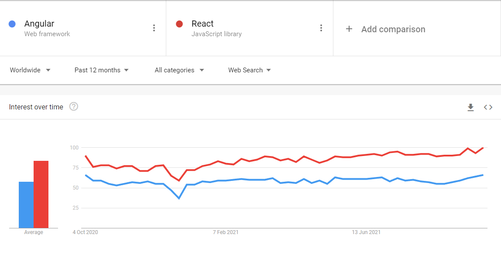
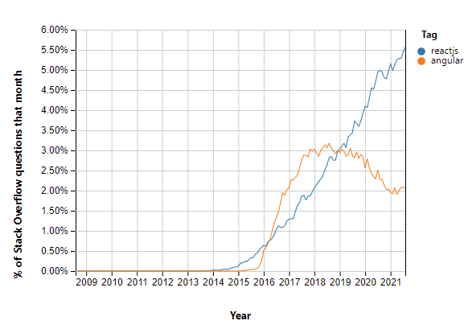

# Frontend research document

## Introduction

In this file I will document my findings and sources during the time I research what frontend framework is most suitable for the KNOWL3DGE project. The research will be done according to the DOT research framework and sources will be cited as is required. 

## Main question: What framework is suitable for use in the KNOWL3DGE project?

What framework is suitable for the project depends on many factors. To find the best fit, we will be investigating several sub-questions and draw a conclusion based on them. Because of the curriculum, we will only be investigating React and Angular.  

### What does the project require, UI-wise?

The project will consist of a main page with many cards showcasing the various 3D printing issues people can have in the form of an image with a title and a short description. The user will be able to read more on a certain topic by expanding the card/going to a details page. Furthermore, on the overview page there should be the possibility to search and filter and sort the displayed results on many different attributes. Lastly, users should be able to view personal info on their own account view.

### What are the technical differences between the two frameworks?

When it comes to the scope of the technology, Angular is quite a lot bigger than react, it being a fully-fledged web framework as opposed to a library as is React.[3][4] This means that Angular fully encompasses all parts of MVC, whereas React only provides the View. This can, however, be expanded by adding in other libraries and extensions to React, such as Flux.[4] Angular works out of the box and does not necessitate adding extra packages.

Data binding is another major differentiating factor between the two. React uses one-way data binding, meaning that changes in the UI do not update the component. Angular uses two-way data binding, meaning that the component and the view are by definition synchronised with each other.

The two also differ in the language used. Both use JavaScript in a way, but in two different ways. React uses JSX, which is JavaScript with an XML extension.[5] Using JSX is not mandatory, but rather encouraged. Angular, on the other hand, uses TypeScript as its primary language.[6] The advantage of TypeScript is that, among other features, it is a typed language. TypeScript is often praised for its ability to make error-spotting easier as it will simply not compile when it has errors.[7] In the end, Angular offers more structure thanks to TypeScript.[9]

With regards to UI components, both allow a collection of Material Design components to be easily downloaded.[4] Angular's is first-party because both are developed by Google, while React's is third-party.

Dependency injection is something that we as students have to prove our mastery of in this semester. Both support dependency injection.[4][8] Some sources, however, say that React does not (fully) support dependency injection.[9]  

Another difference is that Angular uses a "real" DOM while React uses a virtual DOM. Effectively, this means that for tiny changes within the webpage, React is faster because it does not have to re-write the HTML to apply the update.[10][11]

### Which framework has the most extensive documentation?

Angular's documentation could be considered more comprehensive, as it covers everything necessary for a front-end application in the same place. When using React, however, your documentation and references will be more fractures, as React requires more use of third party libraries.[4]

#### Popularity

Both frameworks are reasonably popular, but on both Google Trends and Stack Overflow, React comes out on top.

##### **Google Trends**

The popularity on Google Trends[1] shows how often people search for either framework. While this does not reflect real-world usage, it gives an indication of how often people look up the frameworks for troubleshooting, documentation, educational purposes, or just out of curiosity. Out of the two, React comes out on top, but both seem reasonably popular and are following a similar trend.

##### **Stack Overflow Trends**

  
The data from Stack Overflow[2] again shows higher popularity for React than for Angular. This can be explained by the fact that React is easier to learn and thus attracts more new programmers looking to start with their first web-application. However, it does not necessarily indicate that one framework is more popular than the other when it comes to use within companies.

### Which framework is the most future-proof?

Considering I aspire my applications to grow over time, one would think Angular would be the best fit, as it's often used for other big projects. However, it depends one one's definition of "a large project". It mostly comes down to preference[12], so choose wisely between ease of starting out and the long-term benefits of well-structured applications.

### Which framework is the most beginner-friendly?

Because of Angular's strict typing, more complex structure, and other features of TypeScript that are handy for debugging it has a steeper learning curve than React, which is regarded as easy for beginners and welcoming.[4][9] As such, when it comes to ease of learning, React definitely comes out on top.

### Conclusion

Both React and Angular are quite favourable to choose for this project, as both have their pros and cons.
As I've already chosen Kotlin for the backend because I like challenges, I'm picking Angular for the frontend. While it won't be an easy journey, being used to the structure in C#, I think I'll benefit from the structure TypeScript provides in Angular. The more extensive and collated documentation is another pro. Another factor I weighed is that, while not related to my studies at FHICT, I think that learning TypeScript can advance my personal skills in the world of software engineering. It will, for instance, allow me to write backends with Node.js for personal projects.

## Sources

[1] https://trends.google.com/trends/explore/TIMESERIES/1633359000?hl=en-GB&tz=-120&geo=NL&q=%2Fg%2F11c6w0ddw9,%2Fm%2F012l1vxv&sni=3   
[2] https://insights.stackoverflow.com/trends?tags=reactjs%2Cangular  
[3] https://medium.com/js-dojo/angular-vs-react-vs-vue-choosing-the-front-end-framework-b24302818fb1  
[4] https://www.imaginarycloud.com/blog/angular-vs-react/  
[5] https://reactjs.org/docs/introducing-jsx.html  
[6] https://angular.io/guide/typescript-configuration#:~:text=TypeScript%20is%20a%20primary%20language,compiler%2C%20which%20requires%20some%20configuration.  
[7] https://dzone.com/articles/what-is-typescript-and-why-use-it  
[8] https://marmelab.com/blog/2019/03/13/react-dependency-injection.html  
[9] https://www.freecodecamp.org/news/angular-vs-react-what-to-choose-for-your-app-2/   
[10] https://www.cuelogic.com/blog/what-are-the-differences-between-angular-and-react  
[11] https://www.cleveroad.com/blog/angular-vs-react  
[12] https://www.dottedsquirrel.com/is-angular-dying-because-of-react/ 
