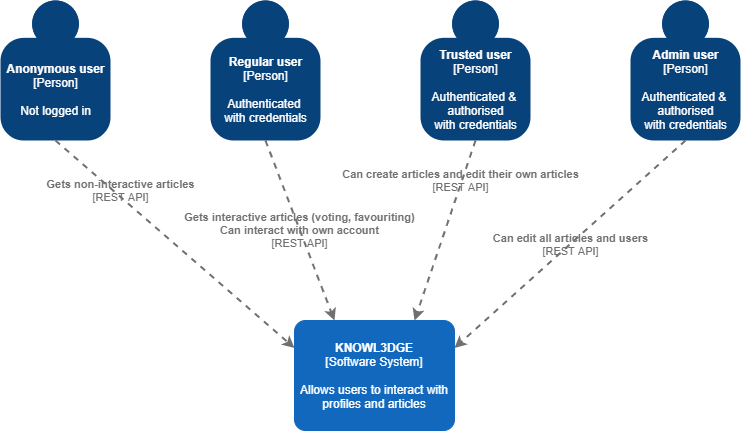
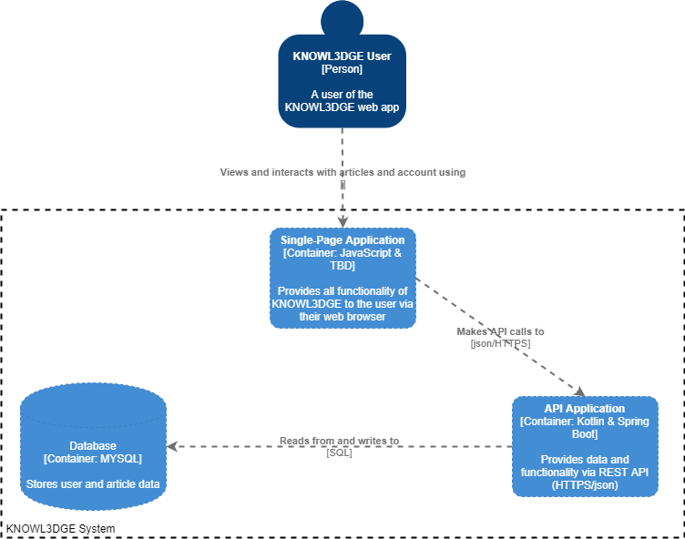
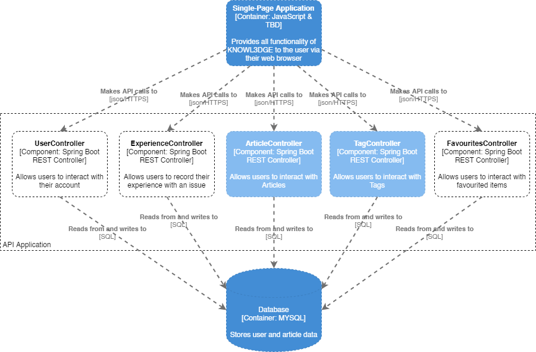
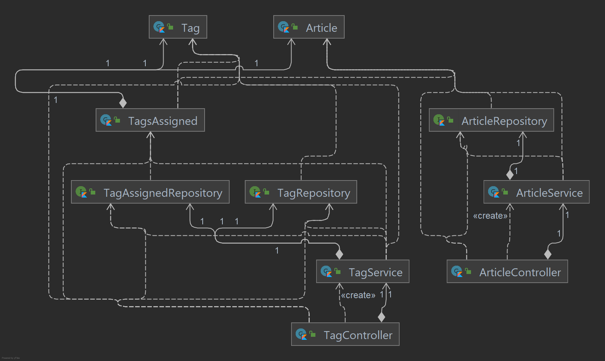
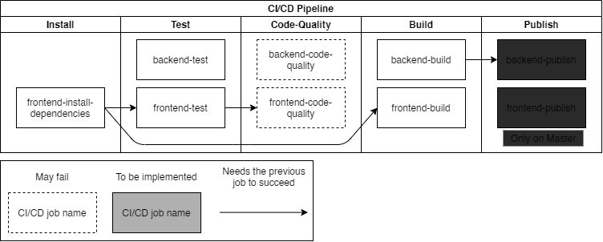

# KNOWL3DGE Software Architecture Document

## Introduction

In this document the architecture of the software (KNOWL3DGE) will be described and drawn out in several diagrams following the [C4 model(https://c4model.com/)].
*Greyed-out elements are not (yet) implemented.*
## System Context (C1)

## Containers & Tech Choices (C2)

## Components (C3)

## Class & Sequence Diagrams (C4)

## CI/CD Pipeline Diagram

## REST API Documentation

| URL                             | Resource     | Access      | Operation | Description                                                                                          |
| ------------------------------- | ------------ | ----------- | --------- | ---------------------------------------------------------------------------------------------------- |
| /login                          | Security     | Any         | POST      | Authenticate user and return JWT                                                                     |
| /api/user                       | Users        | Any         | POST      | Creates a new user (registration)                                                                    |
| /api/user/getuserid/{username}  | Users        | Any         | GET       | Gets userid of user with  {username}                                                                 |
| /api/user/favourites/{username} | Users        | Self        | GET       | Gets all favourites of {username}                                                                    |
| /api/user/favourites            | Users        | Self        | POST      | Adds a favourite entry for user                                                                      |
| /api/user/favourites            | Users        | Self        | DELETE    | Removes a favourite entry for user                                                                   |
| /api/articles                   | Articles     | USER, ADMIN | GET       | Gets a list of all Articles                                                                          |
| /api/articles/{id}              | Articles     | USER, ADMIN | GET       | Gets article with id {id}                                                                            |
| /api/articles?tag={tagId}       | Articles     | USER, ADMIN | GET       | Gets articles with a specific {tagId}                                                                |
| /api/articles?id={articleId}    | Articles     | USER, ADMIN | GET       | Get articles with a specific {articleId}. Can be used to request multiple specific articles at once. |
| /api/articles/{id}              | Articles     | ADMIN       | DELETE    | Deletes article with id {id}                                                                         |
| /api/articles/{id}              | Articles     | ADMIN       | PUT       | Updates article with id {id}                                                                         |
| /api/articles                   | Articles     | ADMIN       | POST      | Creates a new article                                                                                |
| /api/tags/all                   | Tags         | USER, ADMIN | GET       | Gets all tags                                                                                        |
| /api/tags/edit                  | Tags         | ADMIN       | PUT       | Updates a tag                                                                                        |
| /api/tags/new                   | Tags         | ADMIN       | POST      | Creates a new tag                                                                                    |
| /api/tags/delete/{id}           | Tags         | ADMIN       | DELETE    | Deletes a tag                                                                                        |
| /api/tags/new_assignment        | TagsAssigned | ADMIN       | POST      | Creates a new tag assignment                                                                         |
| /api/tags/all_assigned          | TagsAssigned | USER, ADMIN | GET       | Gets all assigned tags                                                                               |
| /api/tags/all_assigned/aid/{id} | TagsAssigned | USER, ADMIN | GET       | Gets all assigned tags for article with {id}                                                         |
| /api/tags/all_assigned/tid/{id} | TagsAssigned | USER, ADMIN | GET       | Gets all assigned articles for tag with {id}                                                         |
| /api/tags/edit_assignment       | TagsAssigned | ADMIN       | PUT       | Updates a tag assignment                                                                             |
| /api/tags/delete_assignment     | TagsAssigned | ADMIN       | DELETE    | Deletes a tag assignment                                                                             |

## Websocket Documentation

| URL   | Description        |
| ----- | ------------------ |
| /chat | Websocket for chat |