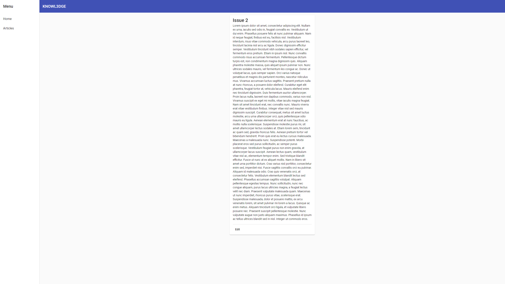
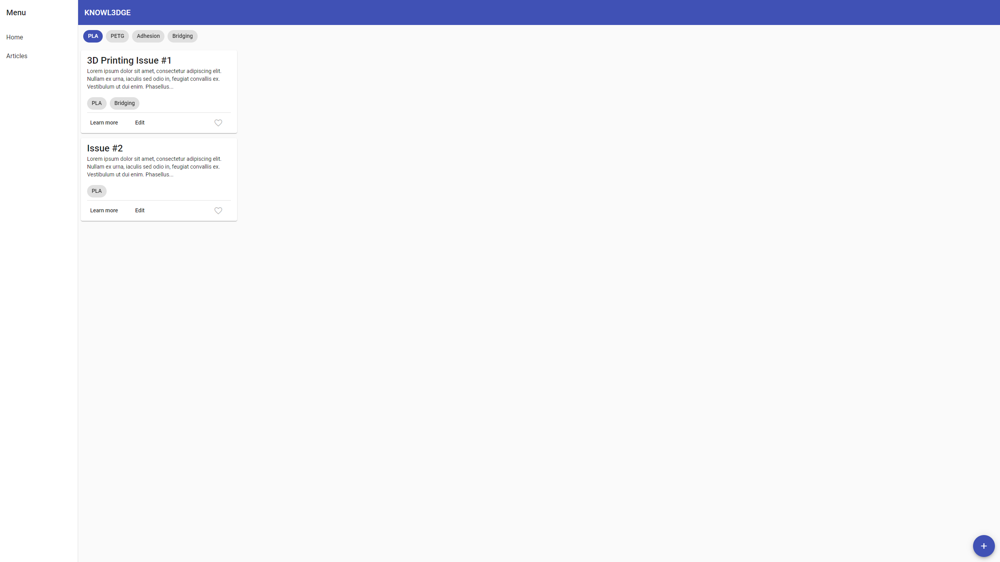
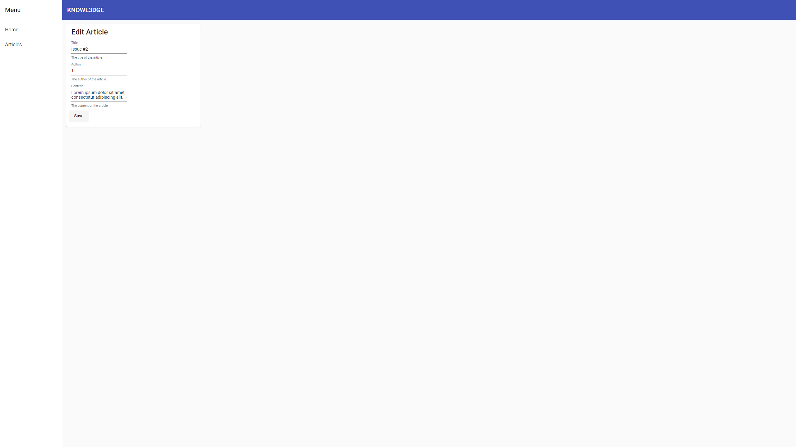
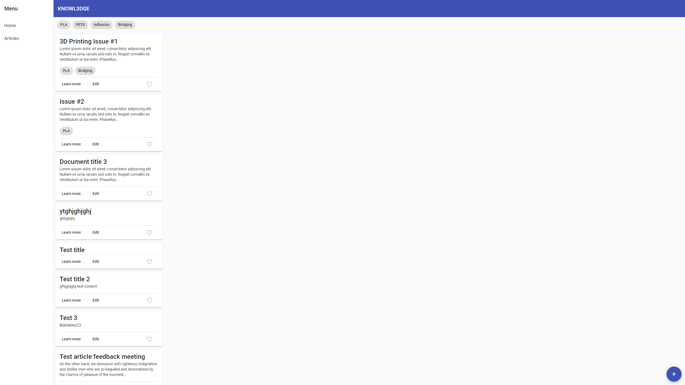
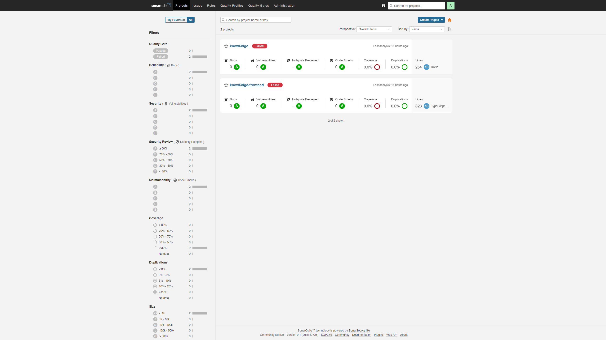

# Screenshots for Sprint 3

# Backend-Frontend Interactivity

Overview page of all articles, with their tags

Overview page, but filtered on tag "PLA"

Details page of an article

Editing page of "Article 2", with the title being changed to "Article #2"

Overview page showing the edited article title "Article #2"

# Unit tests/SonarQube

Because I got stuck with the unit tests (in angular) the coverage is still 0, but this will be improved in the future.
